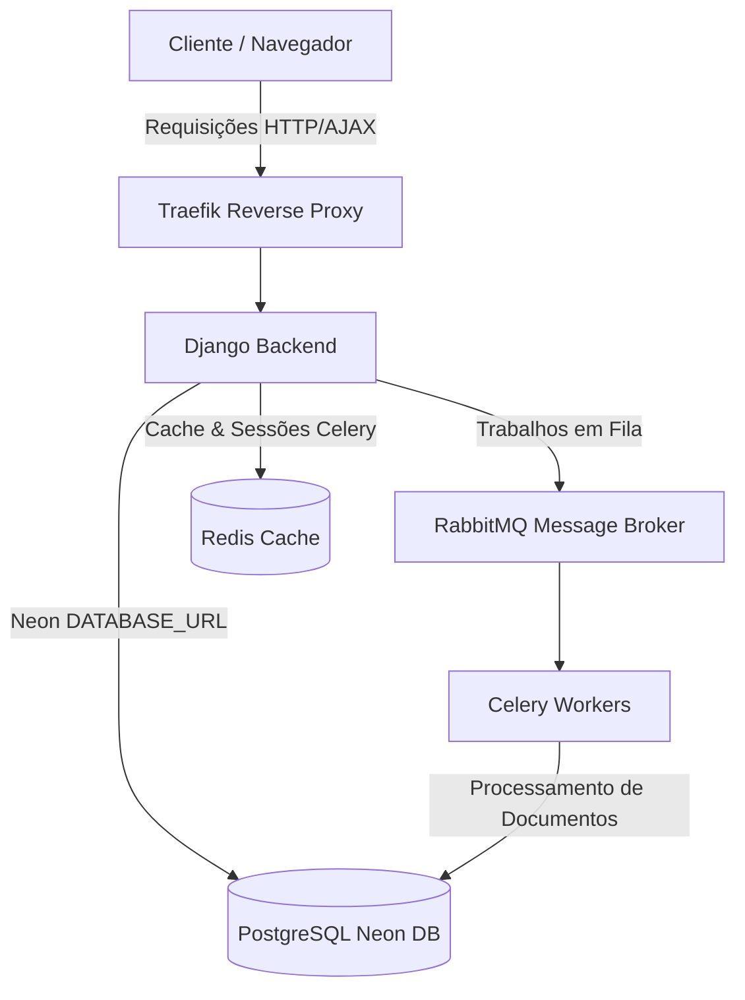

# Sampaio AI - Documentação da Plataforma

Plataforma inteligente e pessoal de estudos de programação baseada em Inteligência Artificial, RAG (Retrieval-Augmented Generation) e Agentes Autônomos.

---

## 1. Arquitetura do Sistema

A arquitetura do **Sampaio AI** é construída com foco em resiliência, escalabilidade e desacoplamento de tarefas pesadas de processamento:



---

## 2. Divisão de Módulos (Apps)

A base de código é modularizada em aplicativos Django focados, facilitando a manutenção e testes individuais:

* **`accounts`**: Modelo de usuário customizado utilizando o e-mail como identificador primário.
* **`uploads`**: Gerenciamento de arquivos enviados pelo usuário (PDFs, TXT, Markdown, CSV, DOCX). Realiza o salvamento físico, deleção e downloads.
* **`knowledge_base`**: Motor de processamento RAG. Extrai texto (utilizando `pypdf` para arquivos binários e extratores XML nativos para DOCX), divide o conteúdo utilizando um splitter recursivo de texto em Python puro e gera vetores de embeddings determinísticos de 384 dimensões.
* **`ai_agents`**: Agente autônomo baseado em **LangGraph** (`StateGraph`). Coordena de forma cíclica ou linear a busca semântica em arquivos do usuário (RAG) e a pesquisa na internet em tempo real (via DuckDuckGo Web Search).
* **`chat`**: Controle de sessões e histórico persistente de conversas de chat.
* **`studies`**: Gerenciador de Planos de Estudo. A IA monta um cronograma semanal detalhado, contendo horas sugeridas, temas e exercícios baseados no nível e disponibilidade do estudante.
* **`flashcards`**: Sistema de fixação de conteúdo baseado em flashcards (Frente/Verso) com suporte ao algoritmo de repetição espaçada **Leitner System** (caixas de 1 a 5 de acordo com a facilidade do usuário).
* **`quizzes`**: Gerador de testes de múltipla escolha com correção instantânea e explicação técnica.

---

## 3. Segurança & Hardening

* **Variáveis Sensíveis**: Gerenciadas estritamente no arquivo `.env` (ou via Docker Secrets no Swarm).
* **Cabeçalhos de Segurança (Hardening)**:
  * Filtro XSS ativo (`SECURE_BROWSER_XSS_FILTER = True`).
  * Bloqueio de detecção automática de MIME type (`SECURE_CONTENT_TYPE_NOSNIFF = True`).
  * Proteção contra clickjacking via Frame Options (`X_FRAME_OPTIONS = 'DENY'`).
  * Redirecionamento HTTPS automático, Cookies de sessão seguros e HSTS configurados automaticamente em modo de produção (`DEBUG = False`).

---

## 4. Comandos Úteis

### Rodando o Projeto em Desenvolvimento
```bash
docker-compose up --build
```

### Rodando a Suíte de Testes Unitários
```bash
$env:DJANGO_SETTINGS_MODULE="core.settings"
.venv/Scripts/python manage.py test
```

### Realizando Backup do Banco de Dados
```bash
$env:DJANGO_SETTINGS_MODULE="core.settings"
.venv/Scripts/python backup_db.py
```
O script gera um dump completo compactado em formato JSON dentro do diretório `/backups/`, omitindo dados temporários e sessões.
